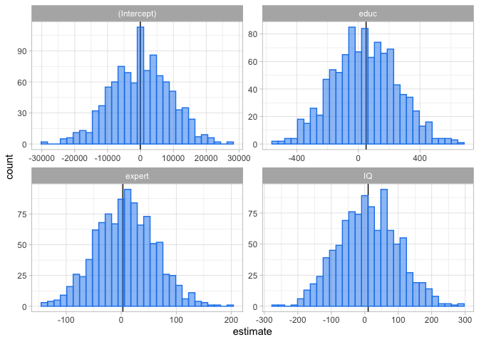
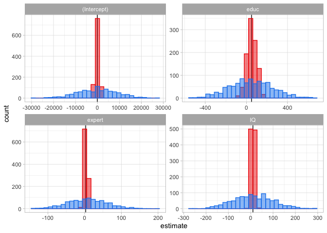
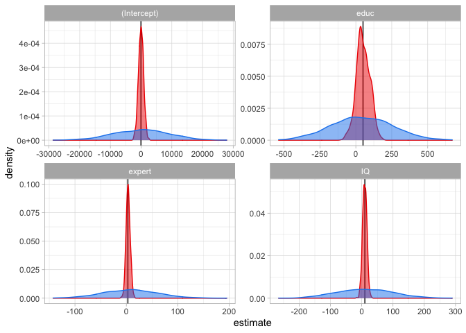

heteroskedaticity vs. BLUE
================
Dominik Kavřík
10/21/2021

``` r
library(tidyverse)
```

    ## ── Attaching packages ─────────────────────────────────────── tidyverse 1.3.1 ──

    ## ✔ ggplot2 3.3.6     ✔ purrr   0.3.4
    ## ✔ tibble  3.2.1     ✔ dplyr   1.1.1
    ## ✔ tidyr   1.2.0     ✔ stringr 1.4.0
    ## ✔ readr   2.1.2     ✔ forcats 0.5.1

    ## ── Conflicts ────────────────────────────────────────── tidyverse_conflicts() ──
    ## ✖ dplyr::filter() masks stats::filter()
    ## ✖ dplyr::lag()    masks stats::lag()

``` r
theme_set(theme_light())
```

# Simulate data with heteroskedastic errors

``` r
set.seed(123)
N=100000
IQ=rnorm(N,100,5)
expert=as.numeric(runif(N, min=0, max=30))
educ = as.numeric(runif(N, min=9, max=20))  
sigma=2*(exp(educ))^0.5             # tvar podmíneného rozptylu, rozptyl závisí na jednom z regresoru 
e4= rnorm(N, 0, sigma)  
wage = -50 +10*IQ+ 50*educ+3*expert + e4       
population = data.frame(IQ,expert, educ, wage)
```

``` r
A <- list(tibble(NA))
R <-  1000

for (i in 1:R){
  
  A[[i]] <- sample_n(population, 800)
}
samples <- tibble(sample = A)

samples %>%
  mutate(model = map(sample, .f= ~lm(wage ~ educ + expert + IQ, data = .)),
         coeffs = map(model, .f = broom::tidy)) %>%
  unnest(coeffs) %>% 
  mutate(true_val = case_when(term=="(Intercept)" ~ -50,
                              term == "IQ" ~10,
                              term == "educ" ~ 50,
                              term == "expert" ~ 3)) -> estimates
```

``` r
data <- A[[10]]

# write.csv(data, "H_data.csv", row.names = FALSE, fileEncoding = "UTF-8")
```

``` r
estimates %>%
  ggplot(aes(x=estimate))+ 
  geom_vline(aes(xintercept =true_val))+
  geom_histogram(color="dodgerblue2", fill="dodgerblue2", alpha=0.5)+
  facet_wrap(~term,scales="free")
```

    ## `stat_bin()` using `bins = 30`. Pick better value with `binwidth`.

<!-- -->

# estimates pomoci WLS

``` r
samples %>% 
  mutate(model_wls = map(sample, .f = ~lm(wage ~ educ + expert + IQ, weights =(1/exp(educ)^0.5), data=.)),
         coeffs_wls = map(model_wls, .f=broom::tidy)) %>% 
  unnest(coeffs_wls) %>% 
  mutate(true_val = case_when(term=="(Intercept)" ~ -50,
                              term == "IQ" ~10,
                              term == "educ" ~ 50,
                              term == "expert" ~ 3)) -> estimates_wls
estimates %>%
  ggplot(aes(x=estimate))+ 
  geom_vline(aes(xintercept =true_val))+
  geom_histogram(aes(x=estimate),data=estimates_wls,color="red2", fill="red2", alpha=0.5)+
  geom_histogram(color="dodgerblue2", fill="dodgerblue2", alpha=0.5)+
  facet_wrap(~term,scales="free")
```

    ## `stat_bin()` using `bins = 30`. Pick better value with `binwidth`.
    ## `stat_bin()` using `bins = 30`. Pick better value with `binwidth`.

<!-- -->

# Probability density

``` r
estimates %>%
  ggplot(aes(x=estimate))+ 
  geom_vline(aes(xintercept =true_val))+
  geom_density(aes(x=estimate),data=estimates_wls,color="red2", fill="red2", alpha=0.5)+
  geom_density(color="dodgerblue2", fill="dodgerblue2", alpha=0.5)+
  facet_wrap(~term,scales="free")
```

<!-- -->

``` r
mod1 <- lm(wage ~ IQ + educ + expert, data = data)
summary(mod1)
```

    ## 
    ## Call:
    ## lm(formula = wage ~ IQ + educ + expert, data = data)
    ## 
    ## Residuals:
    ##     Min      1Q  Median      3Q     Max 
    ## -104888   -2024     -12    1826   88741 
    ## 
    ## Coefficients:
    ##              Estimate Std. Error t value Pr(>|t|)  
    ## (Intercept) 17649.554  10452.554   1.689   0.0917 .
    ## IQ           -175.950    101.784  -1.729   0.0843 .
    ## educ          128.591    159.897   0.804   0.4215  
    ## expert          3.706     57.650   0.064   0.9488  
    ## ---
    ## Signif. codes:  0 '***' 0.001 '**' 0.01 '*' 0.05 '.' 0.1 ' ' 1
    ## 
    ## Residual standard error: 14250 on 796 degrees of freedom
    ## Multiple R-squared:  0.004535,   Adjusted R-squared:  0.0007833 
    ## F-statistic: 1.209 on 3 and 796 DF,  p-value: 0.3055

``` r
library(sandwich)
library(lmtest)
```

    ## Loading required package: zoo

    ## 
    ## Attaching package: 'zoo'

    ## The following objects are masked from 'package:base':
    ## 
    ##     as.Date, as.Date.numeric

``` r
coeftest(mod1, vcov = vcovHC, type = "HC2")
```

    ## 
    ## t test of coefficients:
    ## 
    ##               Estimate Std. Error t value Pr(>|t|)  
    ## (Intercept) 17649.5536 10858.4515  1.6254  0.10447  
    ## IQ           -175.9497   105.3707 -1.6698  0.09535 .
    ## educ          128.5910   229.6744  0.5599  0.57572  
    ## expert          3.7064    56.0789  0.0661  0.94732  
    ## ---
    ## Signif. codes:  0 '***' 0.001 '**' 0.01 '*' 0.05 '.' 0.1 ' ' 1
