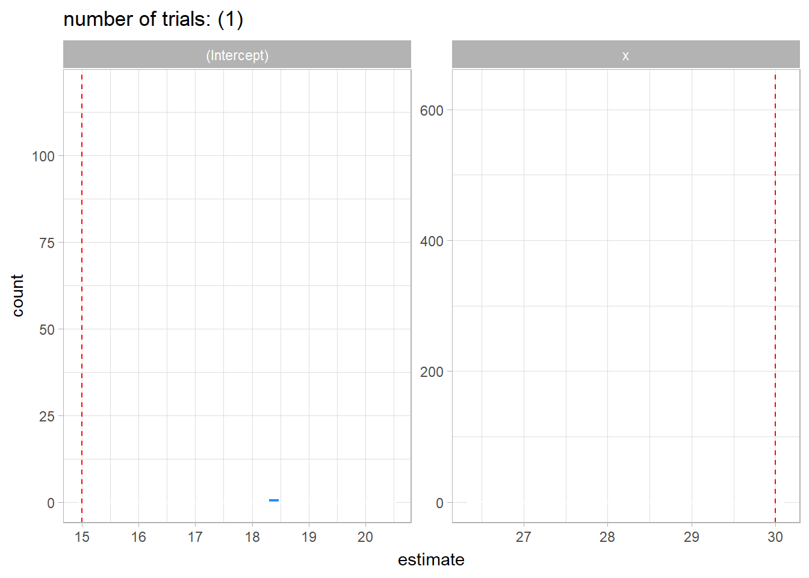

```{r, message=FALSE, warning=FALSE}
library(dplyr)
library(ggplot2)
library(tidyr)
library(purrr)
theme_set(theme_light())
```

# Simulate a population:

Notice that the $x$ is correlated with the error term:

```{r}
set.seed(123)
N = 1000000
v=rnorm(N,0,1)
w=rnorm(N,0,1)
x = rnorm(N, 1 , 4) + 10*v
error = 0-40*v+10*sqrt(1-0.8^2)*w  
y = 15 + 30*x + error
population <- tibble(y,x) 
```

# pick a random sample and visualize it

```{r}
n <- 500
sample <- sample_n(population, n)
```

```{r}
sample %>% 
  ggplot(aes(x,y)) +
  geom_point() + 
  labs(title = "Sample Scatterplot",
       subtitle = paste(n, "observations"))
```

# Simulate sampling trials:
```{r}
set.seed(123)
temp <- list()
ntrials <- 1000
for (i in 1:ntrials){
  temp[[i]] <- sample_n(population, n)
}

samples <- tibble(data = temp, idx=1:ntrials)

```

We saved the data into a nested tibble. now the rows in the first column contains the whole dataset. We can use the `{purrr}` package to access the nested dataframes using `map()` function.


# Create new column with the model estimated using `lm()` function

```{r}
DF_coeffs <- samples %>% 
  mutate(model = map(data, ~lm(y~x,data=.))) %>% 
  mutate(coeff = map(model, broom::tidy)) %>% 
  unnest(coeff)
DF_coeffs
```

# Plot sampling distribution:

```{r}
DF_coeffs %>% 
  mutate(trueval = ifelse(term=="x", 30,15)) %>% 
  select(idx, term, estimate, trueval) %>% 
  ggplot(aes(x=estimate))+
  geom_histogram(fill="dodgerblue", color = "white")+
  geom_vline(aes(xintercept = trueval), linetype="dashed", color = "red")+
  facet_wrap(~term, scales="free")+
  labs(title = "OLS sampling distribution",
       subtitle = "Biased case",
       caption = "Red dashed line is the true population parameter value")
```

Notice, that when $corr(error, x) \neq 0$ the OLS estimator is biased.





