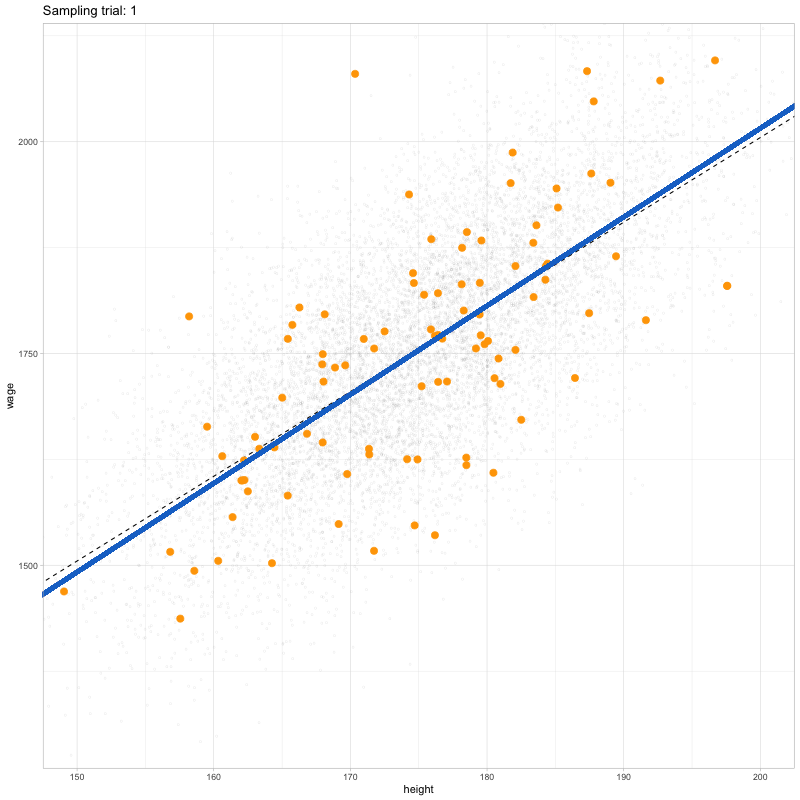

```{r setup, include=FALSE}
library(flexdashboard)
```

# t-test

## Column {data-width=550 .tabset}


### Simulated confidence intervals


```{r, echo = FALSE, message =FALSE,fig.height=10, fig.width=8}
gg_ci
```

### resampling animation 
```{r}

```


Column {data-width=450}
-----------------------------------------------------------------------

```{r}
knitr::kable(t_false_positives %>% 
               mutate(across(where(is.numeric), round, 3)) %>% 
               head()
             )
```

### t distribution and hypothesis testing

```{r, fig.width=10, fig.height=10}
t_dist
```

